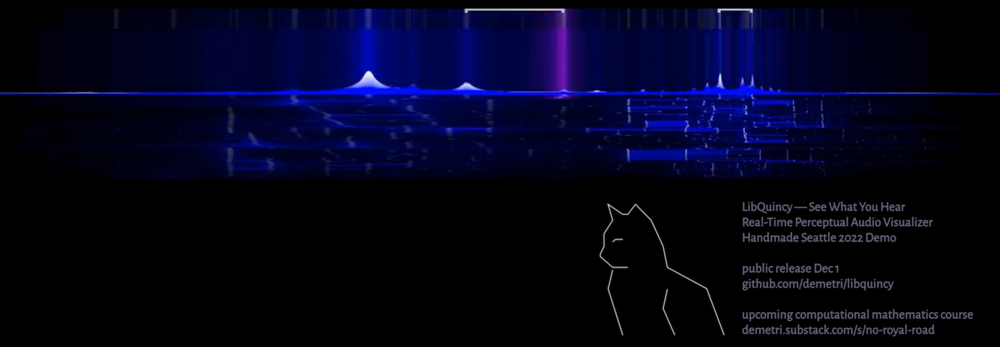

# LibQuincy &mdash; See What You Hear

#### Perceptually-Focused Real-Time Audio Spectrum Visualizer Library in C99/C++

* small (1500LOC), single-file, zero-dependency (not even C stdlib),  easy to integrate with any C/C++ project, with other languages, or with GPU-based visualizations
* algorithm design emphasizes human perception (see below) over other concerns
* visualization design emphasizes high quality real-time animation (easy 60fps in HD quality and 44.1KHz audio, with analytical temporal AA, using 50% of one core and CPU rendering)

## Publicly Available December 1st 2022
Quincy v0.9 will be published December 1st, after I finish some polish and documentation to make it suitable for public use.

Quincy was first presented at [Handmade Seattle 2022](https://handmade-seattle.com/). Conference video will be linked as it becomes available.

## What is it?

Quincy visualizes audio, starting from the familiar baseline of an audio spectrum, but making choices prioritizing the human perception of sound rather than choices focused on mathematical representation, signal processing, or sound engineering.

Here are a few aspects of human perception that are reflected in Quincy's design

* spectrum based on sound salience, not on raw sound pressure (i.e. the numerical data in audio files)
* directly calculated logarithmic-frequency (i.e. "pitch/tone", which is what your mind perceives) based on a high-resolution Fourier filter bank design (this mimics the actual physical structure of your ear); as a non-perceptual side benefit, this makes Quincy independent of frame-rate
* attentional "gain control" (your brain dynamically adjusts what it considers "full volume" based on what is happening in your environment, and also does so differentially across frequencies); this is important because it allows both loud and soft sounds to be seen in the same view without using logarithmic y-axis (common in signal processing tools) which destroys most of the visual detail
* distinguishing habituated sound from sound onset/"attack"
* "smoothpeak" formant detection and tracking (loosely, these are what your brain perceives as identifiable tones in a sound)
* harmonization/resonance detection (Quincy knows a tiny amount about music theory, which is more than can be said for most cats)

## Origin Story

LibQuincy's fiter bank design is loosely analogous to something called the "Constant Q" transform [1]. I used to have a cat, Quincy, whom we usually called Q, and he was very loyal.

Quincy is a byproduct of my larger project, No Royal Road (NR2). an attempt to create a university level mathematics education built from the ground up on interactive media ideas. For lack of a better term, it will be a "math game". NR2 is still in early development, but you can [follow along](demetri.substack.com/s/no-royal-road). 

[1] for human-perception reasons it is not actually a Constant Q filter bank, but that is the closest among the commonly-known filter bank designs